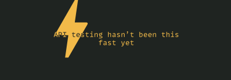

# `req`



`req` is a lightweight, minimal yet powerful HTTP client slash API testing tool
designed for quick testing of APIs in the command line.

## Installation

```console
$ npm i -g req-cli
```

## Documentation

All documentation is built in. Run `req help` to get quick help, and 
`req help walkthrough` to get a walkthrough.
