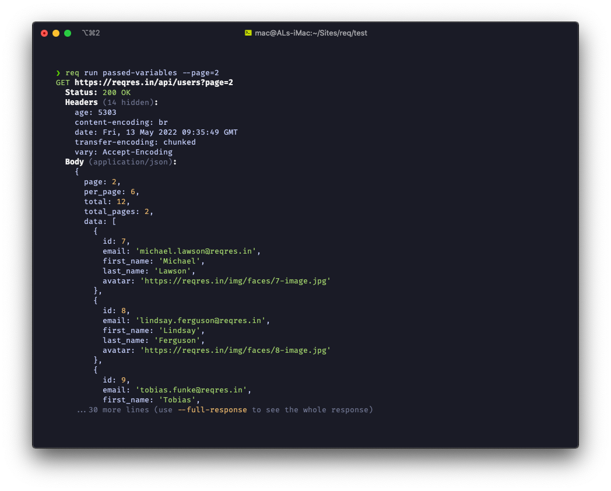
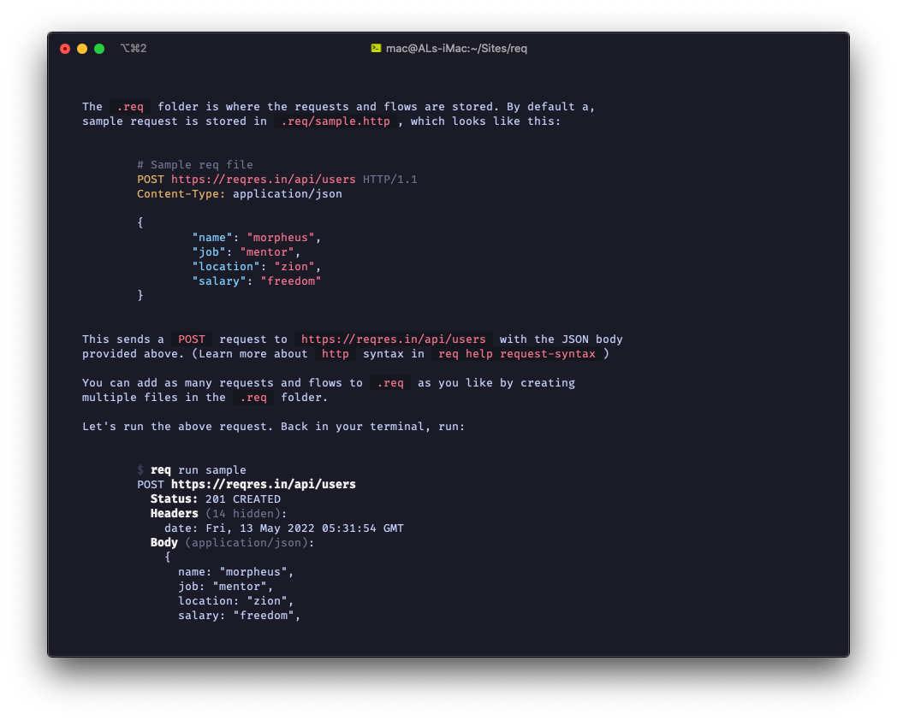

<h1> <code>req</code></h1>

<a href="https://www.producthunt.com/posts/req-2?utm_source=badge-featured&utm_medium=badge&utm_souce=badge-req&#0045;2" target="_blank"></a>

`req` is a lightweight, minimal yet powerful HTTP client slash API testing tool
designed for speed.


## Contents

- [Features](#features)
- [Installation](#installation)
- [Documentation](#documentation)
- [Contributing](#contributing)
- [Contact](#contact)
- [License](#license)

## Features



- **Blazing fast**: The whole reason `req` was made is because of the lack of
  fast API testing tools.
- **Feature packed**: `req` has all the features you can expect from a modern
  HTTP client. And if something is missing, just
  [let me know!](https://github.com/SiddharthShyniben/req/issues).
- Beautiful output
- Beautiful documentation

## Installation

To install `req`, you will need to have [Node.js](https://nodejs.org/) and
[npm](https://npmjs.org) installed. Once you have those installed, simply run:

```console
$ npm i -g req-cli
```

## Documentation



All documentation is built in. Run `req help` to get quick help, and 
`req help walkthrough` to view a quick walkthrough.

## Contributing

Contributions are always welcome. Feel free to open an issue or pull request!

## Contact

I'm mainly active on discord as @SiddharthShyniben#7017.
Every other platform I exist on, my username is either SiddharthShyniben or
SiddharthShyn.

## License

This project uses the [GPLv3](./LICENSE) license.

<p align='center'>

</p>
